# [Day-2] Introduction to Airflow: `Connection` and `Hook`

## Understanding `Connection` and `Hook`

### Airflow `connection`

- Airflow `connection` makes the DAG be able to interact with an external tools (http, AWS, GCP or dbt service). `connection` stores a set of parameters, such as: `username`, `password`, `host`, other parameters with a unique `ConnectionID`.


- There are 2 ways to define a `connection`: 

    a) In the Airflow metadatabase (using the CLI or the Airflow dashboard). When you create a `connection` in the database, each time a task needs this `connection`, it requests the database. However, for the learning purpose, we are going to implement this method.

    b) In an Environment Variables. With `connection` in Environment Variables, the task doesn't need to request the database. Airflow checks if the corresponding `connection` exists and grabs it without accessing the database. 

- Now, we are going to create DAG that will call an API to predict gender based on name via [gender-api](https://gender-api.com/v2) using the defined `connection`, then print the result to the console. 

- First of all, to be able to make a request call to [gender-api](https://gender-api.com/v2), we need to create account via email address, then activate it.

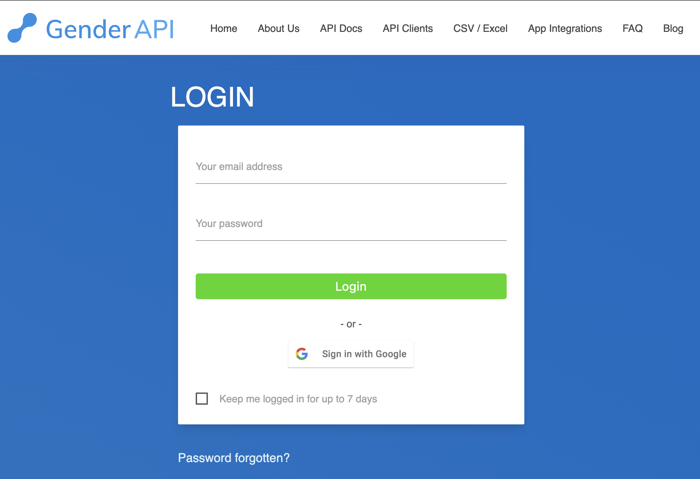

- Once our account is activated, we will see this page.

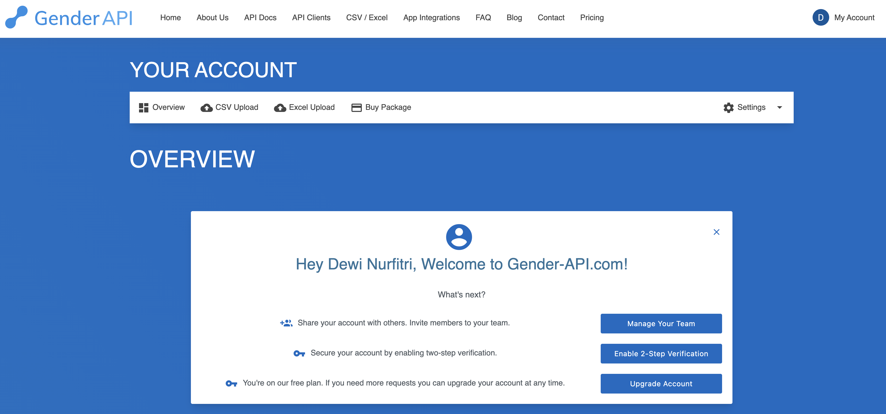

- Scroll down to the bottom then copy the generated authentication bearer token.

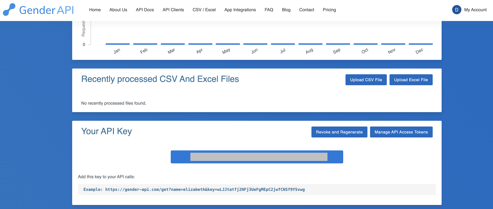

- Then, go to Airflow dashboard to add new connection.

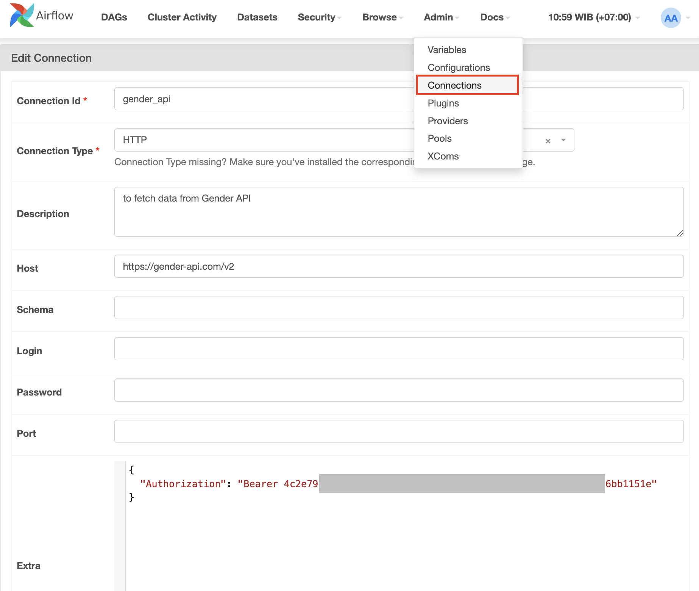

- Under the DAG, we will create some `tasks` that implement `SimpleHTTPOperator`. This is the `task` that make a `GET` request to endpoint `/statistic` using `http_conn_id="gender_api"`  as we define in `connection`. This endpoint will resolve the statistic of Gender API usage. The `log_response=True` prints out the API result to the console.

```
    get_statistic = SimpleHttpOperator(
        task_id="get_statistic",
        endpoint="/statistic",
        method="GET",
        http_conn_id="gender_api",
        log_response=True,
        dag=dag
    )

```

- The next `task` makes a `POST` request to predict the gender of a given name. The `data` contains parameter suchs as: `country` and `first_name` that we want to predict. Please refer to [Gender-API documentation](https://gender-api.com/en/api-docs/v2) for a more detail explanation.

```
identify_name = SimpleHttpOperator(
        task_id="post_name",
        endpoint="/gender/by-first-name-multiple",
        method="POST",
        data='{"country": "ID", "locale": null, "ip": null, "first_name": "Musa"}',
        http_conn_id="gender_api",
        log_response=True,
        dag=dag
    )
    
```

- The next task is to print the URI using `Hook`. We are going to explain about `hook` in the next part. The `my_uri` function is executed with `PythonOperator`.

```
    def my_uri():
        from airflow.hooks.base import BaseHook
        print(f"Gender API URI ", BaseHook.get_connection("gender_api").get_uri())

    print_uri = PythonOperator(
        task_id = "print_uri",
        python_callable = my_uri
    )

```

- Next, specify the order of the task 

```

    get_statistic >> identify_name >> print_uri

```

- Go to Airflow dashboard and execute the DAG to see the result.

- `get_statistic` task console shows the statistic of Gender API usage. 

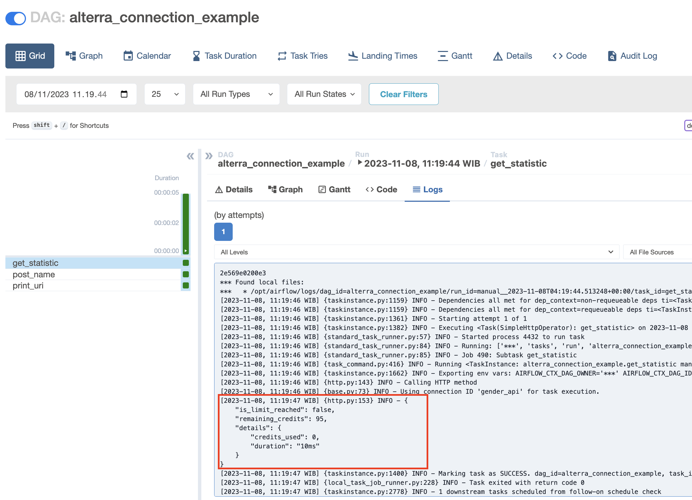

- `identify_name` task console shows the name prediction result.

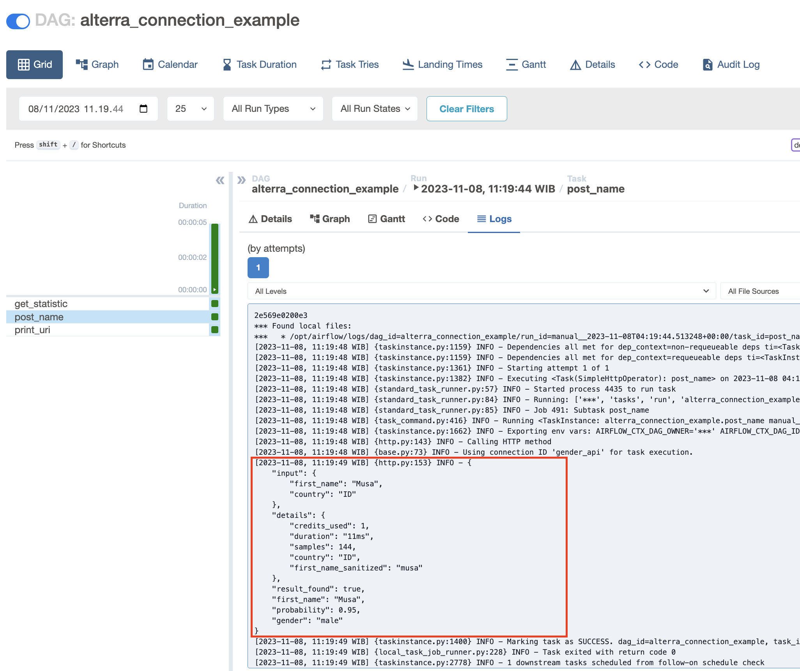

- `print_uri` task console shows the URI 

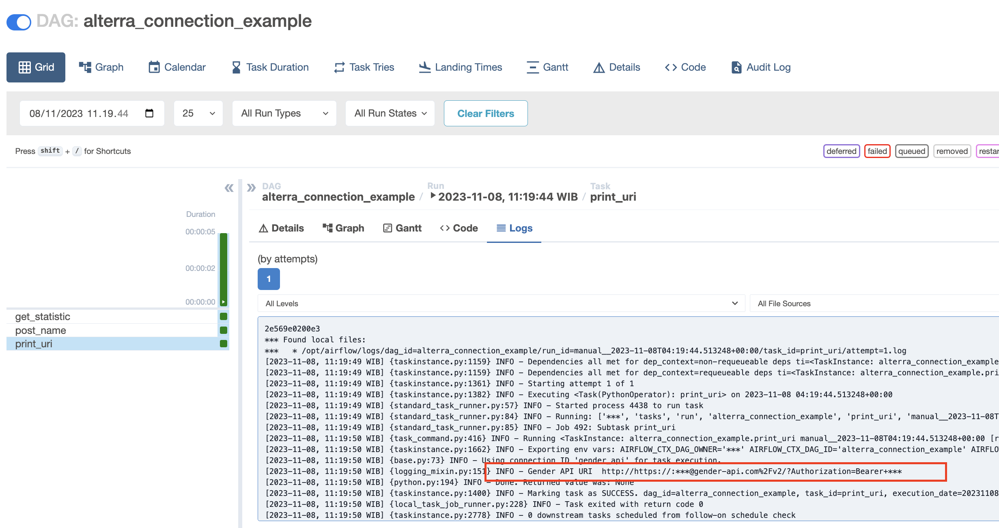


### Airflow `Hook`
- A `hook` is an abstraction of a specific API that allows Airflow to interact with an external system. 

- To use a `hook`, you typically need a `connection id` from `Connections` to connect with an external system. For example, the `PostgreHook` automatically looks for the Connection with a `connection id` of `postgres_default` if you don’t pass one in.

- The difference from `operator` is, `operator` provides a way to create `task` that may or may not communicate with some external services, while `hook` are reusable block that manage interaction with external services.

- Some built-in `hook` are: `HTTPHook`, `S3Hook`, `PostgresHook`, `MysqlHook`, `SlackHook`, etc. In this part, we are going to schedule a DAG that will create a table and load data from local to Postgresql with `PostgresHook`. The code can be found [here](./docker/dags/hook_example.py).


- First of all, we need to define a `connection id` from `Connections` that contains PostgreSQL connection information. PostgreSQL connection information can be seen at `postgres` service in the [docker-compose file](./docker/docker-compose.yaml).


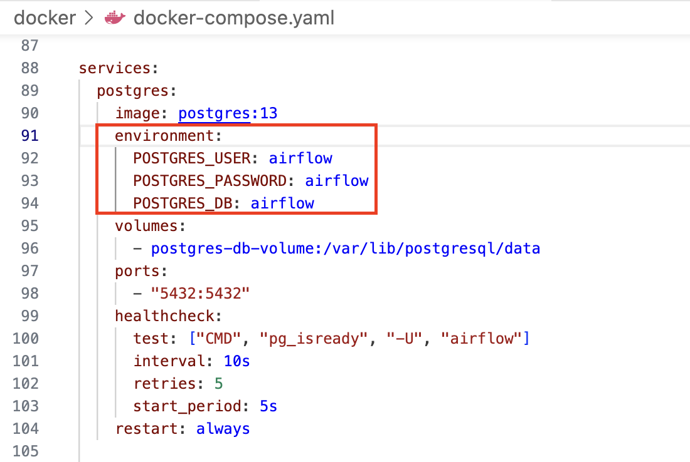

- Let's define a postgres `connection id` via dashboard.

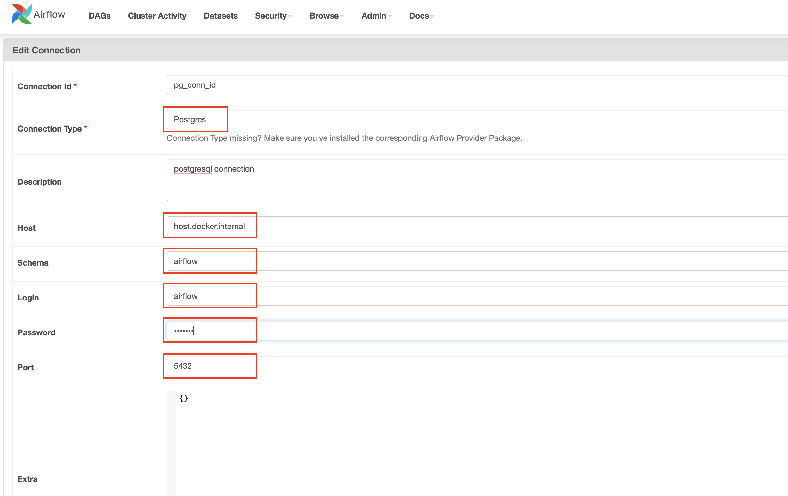

- Then, let's go to this [code](./docker/dags/hook_example.py). Inside the DAG, create a `task` (instantiate `PostgresOperator`) that connect to postgresql and create table `yellow_tripdata` on it.

```
    create_table_in_db_task = PostgresOperator(
        task_id = 'create_table_in_db',
        sql = ('CREATE TABLE IF NOT EXISTS yellow_tripdata ' +
        '(' +
            'vendor_id BIGINT, ' +
            'tpep_pickup_datetime TIMESTAMP WITHOUT TIME ZONE, ' +
            'tpep_dropoff_datetime TIMESTAMP WITHOUT TIME ZONE, ' +
            'passenger_count BIGINT, ' +
            'trip_distance FLOAT(53), ' +
            'ratecode_id BIGINT, ' +
            'store_and_fwd_flag TEXT, ' +
            'pu_location_id BIGINT, ' +
            'do_location_id BIGINT, ' +
            'payment_type BIGINT, ' +
            'fare_amount FLOAT(53), ' +
            'extra FLOAT(53), ' +
            'mta_tax FLOAT(53), ' +
            'tip_amount FLOAT(53), ' +
            'tolls_amount FLOAT(53), ' +
            'improvement_surcharge FLOAT(53), ' +
            'total_amount FLOAT(53), ' +
            'congestion_surcharge FLOAT(53) ' +
        ')'),
        postgres_conn_id='pg_conn_id', 
        autocommit=True,
        dag=dag
    )
```

- The connection to postgresql is created via `postgres_conn_id='pg_conn_id'`

- Create a function to connect to postgresql database via `PostgresHook`, read data from csv file, then load it to postgresql.

```
    def loadDataToPostgres():
        pg_hook = PostgresHook(postgres_conn_id='pg_conn_id').get_conn()
        curr = pg_hook.cursor("cursor")
        with open('/opt/airflow/dags/sample.csv', 'r') as file:
            next(file)
            curr.copy_from(file, 'yellow_tripdata', sep=',')
            pg_hook.commit()
```

- Create a task that instantiate `PythonOperator` that will execute the `loadDataToPostgres` function.

```
    load_data_to_db_task = PythonOperator(
        task_id='load_data_to_db',
        python_callable=loadDataToPostgres,
        dag=dag
    )
```

- Next, specify the order of the task 

```
    create_table_in_db_task >> load_data_to_db_task
```

- Go to Airflow DAG dashboard, then run the DAG `alterra_hook_example`. On the detail of the DAG dashboard, we can see that there are 2 tasks marked as success.

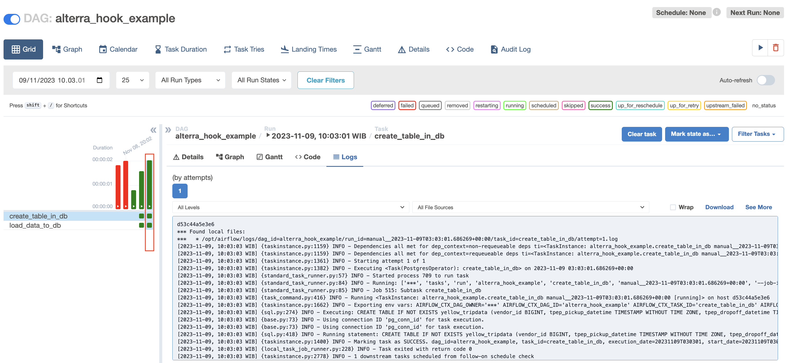

- Use DBeaver and create connection to our PostgreSQL database, to check whether the data is ingested or not.

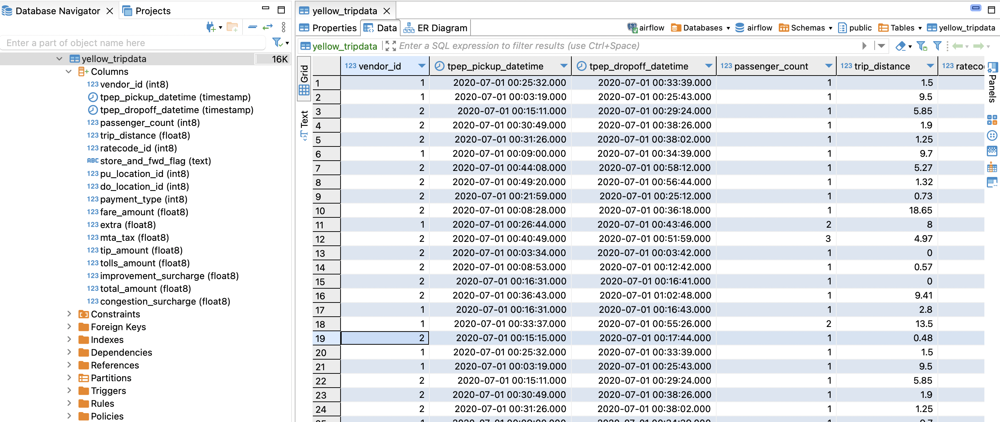


## [Day-2] TASKS
Create a DAG that contain several tasks: 

- A task that predict multiple names from gender-api with SimpleHTTPOperator, refer to this [API documentation](https://gender-api.com/v2).

- A task to create table in postgresql. Suppose the prediction result returned a json data like below.

    ```
    [
        {
            "input": {
                "first_name": "sandra",
                "country": "US"
            },
            "details": {
                "credits_used": 1,
                "duration": "13ms",
                "samples": 9273,
                "country": "US",
                "first_name_sanitized": "sandra"
            },
            "result_found": true,
            "first_name": "Sandra",
            "probability": 0.98,
            "gender": "female"
        }
    ]
    ```
    Create a table with columns: `input`, `details`, `result_found`, `first_name`, `probability`, `gender` and `timestamp`. Timestamp refers to the time where the data is loaded to Postgre. Please define the appropriate data type for each column.

- A task that will load all the prediction result to table `gender_name_prediction` postgresql with `PostgresHook`. Duplication data are allowed.