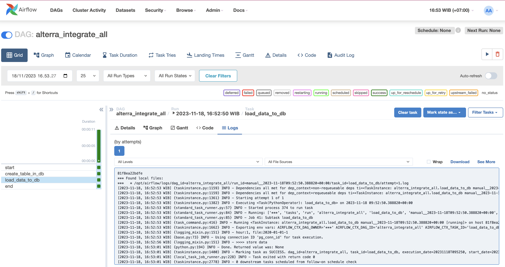
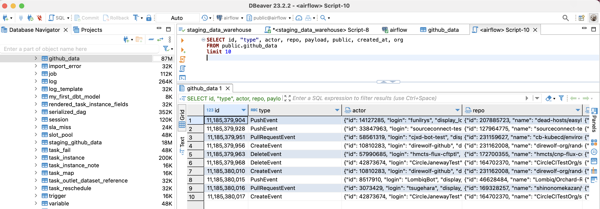
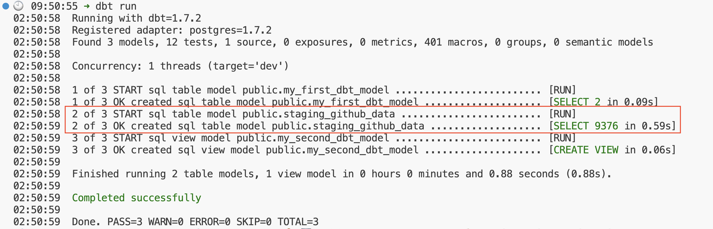

# [Day-3] Schedule an End-to-End Data Pipeline

In this section, we are going to create schedule an end to end ETL pipeline with Airflow. The ETL pipeline covers some steps, including: extract json dataset from a url, load it to our data warehouse (postgresql) and transform it with dbt. The full code can be found in 3 parts: 

- [Part-1](./docker/dags/integrate_all.py)
- [Part-2](./docker/dags/integrate_all_part2.py)
- [Part-3](./docker/dags/integrate_all_part3.py)

## Extract and Load the Dataset to PostgreSQL

- The full code can be found in [Part-1](./docker/dags/integrate_all.py)

- We are going to ingest dataset from [github archives api](https://www.gharchive.org/) containing daily github logs from all developers around the world. 

- In previous lesson, we have learned about ingesting data from github archives api to postgres. Here is the [ingestion code](https://github.com/Immersive-DataEngineer-Resource/ingestion-data/blob/main/ingestion_data/api_to_postgres.py). Currently, we are going to modify the ingestion code and stitch it between tasks within Airflow DAG.


- In the `extract` function, we use PostgresHook to connect to the Postgres database and `get_sqlalchemy_engine` method to get the Postgresql engine.
```
        pg_hook = PostgresHook(postgres_conn_id='pg_conn_id')
        engine = pg_hook.get_sqlalchemy_engine()
```

- The next sequence lines are the json read process per chunked data (depend on `chunk_size` value), load it to a dataframe, and load the dataframe to postgresql.

- The `extract` function is executed in a `PythonOperator` task named `load_data_to_db_task`. 

```
    load_data_to_db_task = PythonOperator(
        task_id='load_data_to_db',
        python_callable=extract,
        op_kwargs=None,
        dag=dag
    )
```

- Set the downstream task. The `DummyOperator` is added to the DAG (as `start` and `end` tasks) to represent a task that needs to be done. This operator actually does not perform any actual work.

```
start >> create_table_in_db_task >> load_data_to_db_task >> end
```

- Let's spin up docker and airflow. Run or "clear task" the `alterra_integrate_all` DAG to execute the data ingestion . 



- Let's see the result on DBeaver



## Transform the Dataset in Postgresql

- The full code can be found in [Part-2](./docker/dags/integrate_all_part2.py)

### Setup dbt project in local directory

- to setup dbt directory on local machine, review material about [dbt](https://github.com/Immersive-DataEngineer-Resource/dbt-demo).

```
python -m venv .venv
source .venv/bin/activate
pip install dbt-core
pip install dbt-postgres # Note: DBT has many DBMS adapter

```
- initiate a dbt project named `transactions`, under `docker` directory.

```
cd docker 
dbt init transformation

```

- A `transactions` directory is created, this is our dbt project working directory. Now, let's setup profiles.yml

```
cd transformation/
mkdir profiles
touch profiles/profiles.yml
```

- fill profiles.yml with the credential to connect to postgresql.

```

transformation:
  outputs:

    dev:
      type: postgres
      threads: 1
      host: localhost
      port: 5432
      user: airflow
      pass: airflow
      dbname: airflow
      schema: public
  target: dev


```

- create a file named dbt.env to store environment variable for DBT

```
export DBT_PROJECT_DIR=$(pwd)
export DBT_PROFILES_DIR=$(pwd)/profiles
```

- run dbt debug command

```
source dbt.env && dbt debug

```

### Create a dbt model to deduplicate rows in Postgres

- We can define model under `models` directory. We can define as much as models that we need. Now, we are going to create a model that will filter data from duplicate rows.

- Duplicate rows may happen when we run the ingestion task multiple times. Therefore, we need to create a layer to filter the latest data from possibly duplication rows.

- Let's create a folder named `staging`. Inside `staging` directory, define a schema as such in this [schema file](./docker/transformation/models/staging/schema.yml). We also put some tests, to make sure that the data are not null.

- In the same directory, create a model [staging_github_data.sql](./docker/transformation/models/staging/staging_github_data.sql). 

- This model contains one of window functions named `row_number()`. a `row_number()` function is to specify a unique sequential number for each row in a set of rows as per the categorization defined in the `over()` clause. A new column `__rank` stores the sequential number.

```
WITH ranked AS (
    SELECT id, 
        type, 
        actor, 
        repo,
        payload,
        public, 
        created_at, 
        org,
        ROW_NUMBER() OVER (
        PARTITION BY id
        ORDER BY created_at DESC NULLS LAST
        ) AS __rank
    FROM {{ source('staging', 'github_data') }}
)

```

- Then, filter only the the data with the `__rank` column value equals to 1.

```

SELECT id, 
    type, 
    actor, 
    repo,
    payload,
    public, 
    created_at, 
    org
FROM ranked
WHERE __rank = 1

```

- On the terminal (in dbt project directory `transformation`) , run this command

```
dbt run
```



- Open DBeaver, there must be a table named: `staging_github_data` containing non-duplicate row from `github_data` table.