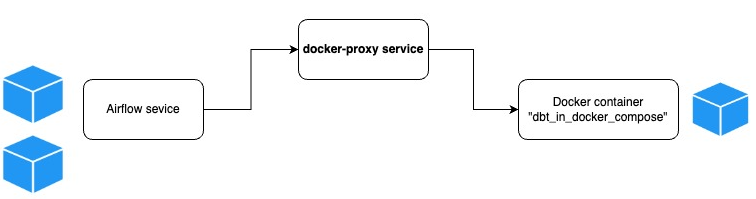
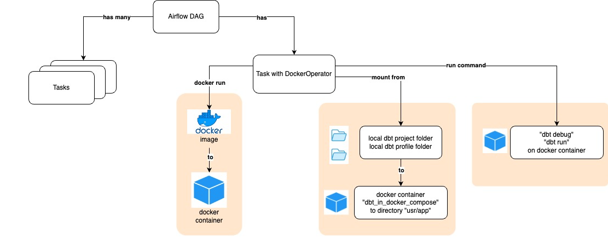
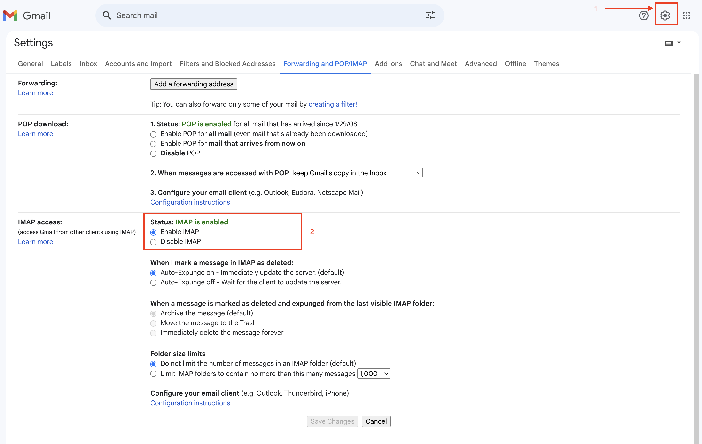

# [Day-4] Schedule an End-to-End Data Pipeline


### Orchestrating Airflow and dbt with DockerOperator

- The full code can be found in [Part-2](./docker/dags/integrate_all_part2.py)

- To orchestrate a dbt command task to a DAG, we are going to implement `DockerOperator`. 

- `DockerOperator` allows us to run tasks in containers using Docker. When executed, `DockerOperator` will start running a container and wait for the container to finish running whatever it was supposed to do (similar to `docker run` in terminal).


- To handle the `DockerOperator`’s permissions, we’ll need to create a proxy container in the docker-compose.yaml file. This is a secure way to handle the issue of permissions to /var/run/docker.sock file.



```
  docker-proxy:
    image: bobrik/socat
    command: "TCP4-LISTEN:2375,fork,reuseaddr UNIX-CONNECT:/var/run/docker.sock"
    ports:
      - "2376:2375"
    volumes:
      - /var/run/docker.sock:/var/run/docker.sock
```

- Change host in [profiles.yml](./docker/transformation/profiles/profiles.yml), from `localhost` to `host.docker.internal`

- We should define an image that contain a dbt in a [Dockerfile](./docker/Dockerfile). This image will be containerized by `DockerOperator`.

- To build the Dockefile image, we can do it either via `docker build` command in terminal or via docker-compose.yml. Add this command to [docker-compose.yml](./docker/docker-compose.yaml) file, `services`. This code will build an image named `dbt_in_docker_compose` from the [Dockerfile](./docker/Dockerfile).

```
  dbt:
    build: .
    image: dbt_in_docker_compose
```

- Now, let's define the tasks that will instantiate `DockerOperator` to run dbt command.

```
    local_path = "/<your-local-working-path>/airflow-data/docker"
    
    dbt_debug_cmd = DockerOperator(
        task_id='dbt_debug_cmd',
        image='dbt_in_docker_compose',
        container_name='dbt_container',
        api_version='auto',
        auto_remove=True,
        command="bash -c 'dbt debug'",
        docker_url="tcp://docker-proxy:2375",
        network_mode="bridge",
        mounts = [
            Mount(
                source=f"{local_path}/transformation", 
                target="/usr/app", 
                type="bind"
            ),
            Mount(
                source=f"{local_path}/transformation/profiles",
                target="/root/.dbt",
                type="bind"
            )
        ],
        mount_tmp_dir = False
    )

```

-  what actually DockerOperator do:


    


``` 
    start >> create_table_in_db_task >> load_data_to_db_task >> dbt_debug_cmd >> dbt_run_cmd >> end 

```

## Send success/failed notification to email
- The full code can be found in [Part-3](./docker/dags/integrate_all_part3.py)

- Enable IMAP for the SMTP. 
    - Go to the settings in your Gmail Account. Click on the ‘Forwarding and POP/IMAP‘ tab 
    - Enable the IMAP radio button from the sub-section "IMAP access"

    

- Setup Google app passwords security [here](https://security.google.com/settings/security/apppasswords)
    - Login to our gmail account
    - Type a new app name, then click on "Create"
    - Rename file airflow.env.template to airflow.env
    - Copy the generated password for the new app, then paste it on airflow.env 
    ```
    export AIRFLOW__SMTP__SMTP_USER = 'your-gmail-account'
    export AIRFLOW__SMTP__SMTP_PASSWORD = 'generated-app-password'
    ```
    
    
    
    - After this lessons, please delete the password for safety reason.

- setup SMTP config on [docker-compose.yml](./docker/docker-compose.yaml), service `x-airflow-common` > `environment`

```
    AIRFLOW__SMTP__SMTP_HOST: 'smtp.gmail.com'
    AIRFLOW__SMTP__SMTP_STARTTLS: True
    AIRFLOW__SMTP__SMTP_SSL: False
    AIRFLOW__SMTP__SMTP_USER: ${AIRFLOW__SMTP__SMTP_USER}
    AIRFLOW__SMTP__SMTP_PASSWORD: ${AIRFLOW__SMTP__SMTP_PASSWORD}
    AIRFLOW__SMTP__SMTP_PORT: 587
    AIRFLOW__SMTP__SMTP_MAIL_FROM: 'no-reply@gmail.com'

```

- Go to send_email task in the [DAG code](./docker/dags/integrate_all.py), then change the destination email on the `to` parameter under `EmailOperator`.

```
    send_email = EmailOperator(
        task_id='send_email',
        to='destination-email@email.com',
        subject='Notification from Alterra DE Course',
        html_content='This is a test email from Alterra DE Course. Happy Learning!',
        dag=dag
    )
```

- rerun docker with this command: 

```
    docker-compose -f docker/docker-compose.yaml --env-file docker/airflow.env up

```

- once all the services are up, go to airflow dashboard then rerun the DAG or "clear task" the send_email task.


- check the destination email
